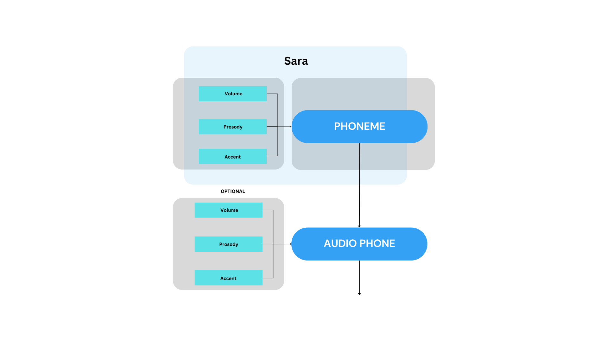
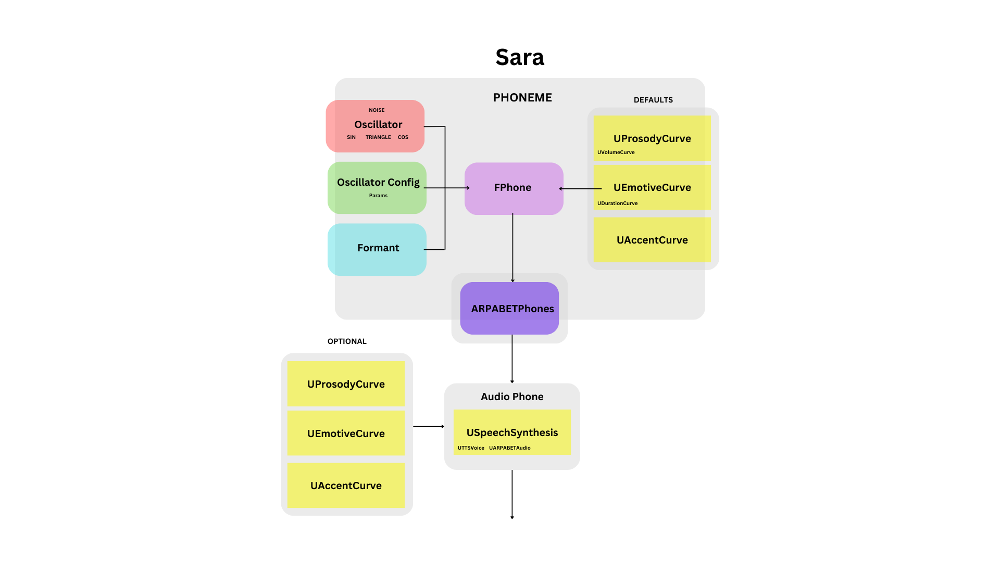
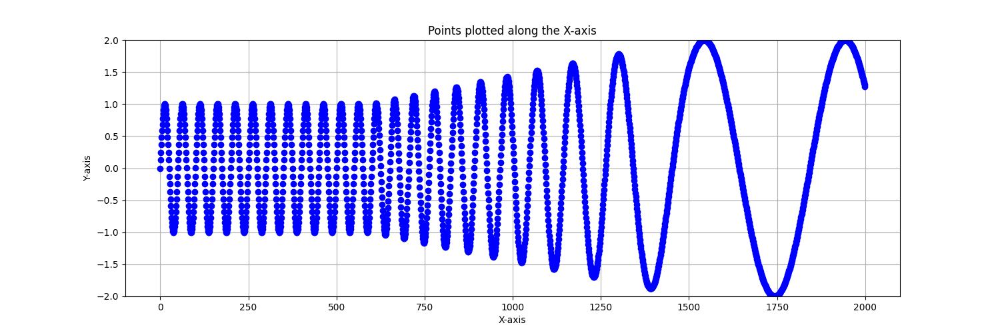
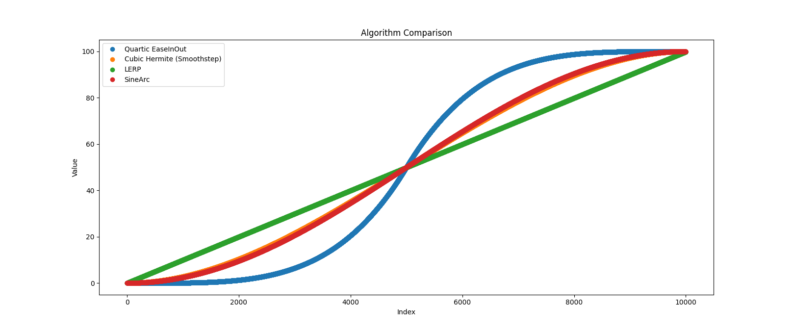
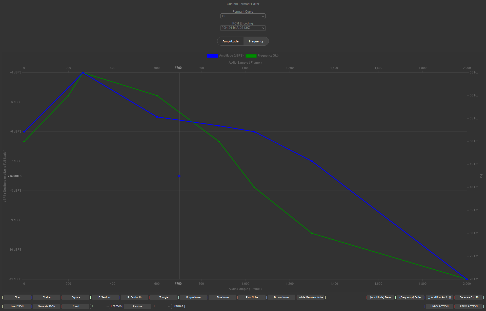
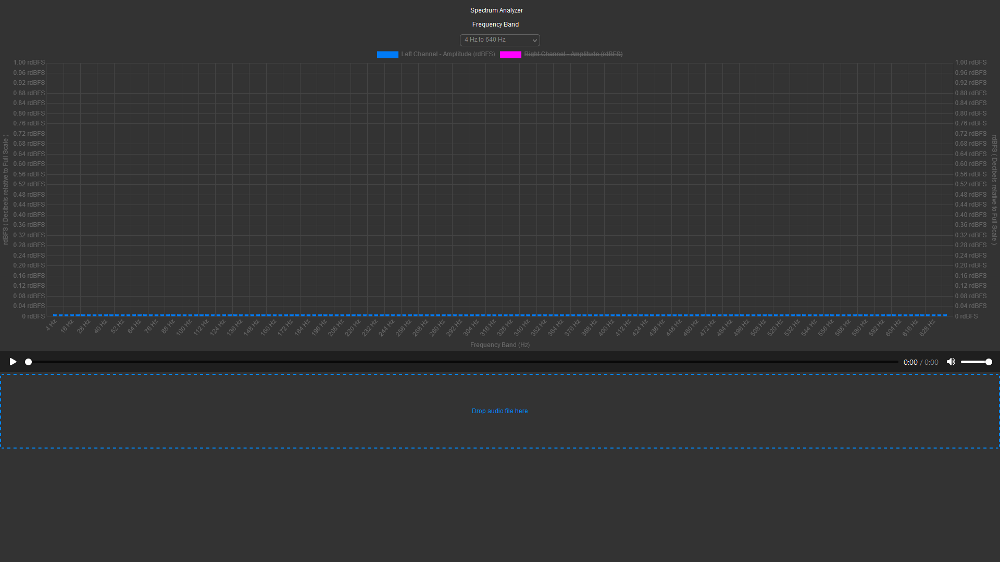
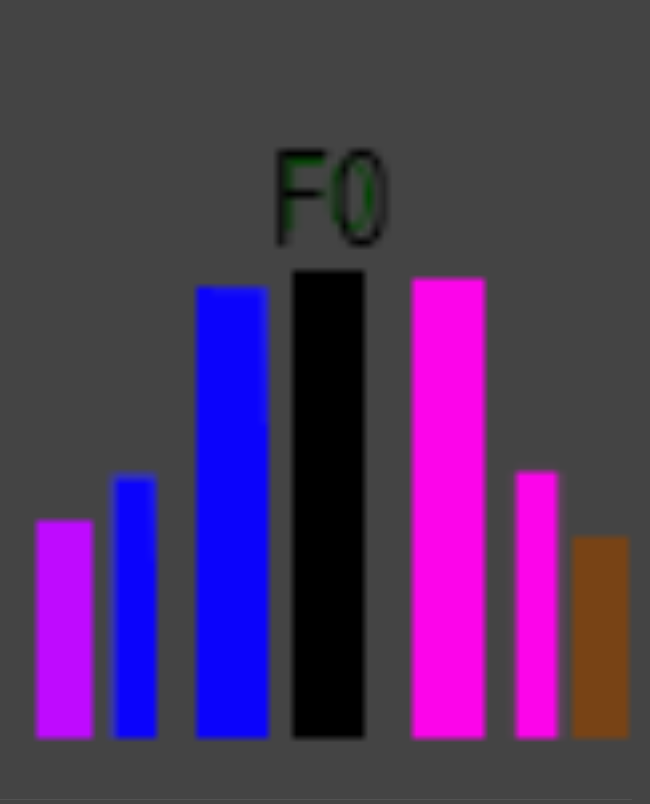

# Concatenative Speech Synthesis for Unreal Engine 5
Concatenative Speech Synthesis, Text-to-Speech library and re-speecheer voice-mapping tool based on MARYTTS for Unreal Engine 5.


<b>Speech Synthesis Architecture for Sara at Audio_Phone [ k ].</b>  


<b>Speech Synthesis Architecture for Sara at Audio_Phone [ k ] (Module Level).</b>  


### Based upon MaryTTS 2.5

This is a multilingual open-source text-to-speech and speech-to-speech platform (re-speecher) suitable for use in theatrical production, based on the MaryTTS text-to-speech library,
 compatible with any platform that has a Java runtime installed, it is developed for the Unreal Engine 3D graphics game engine.

<br>
<span>Schwa (phoneme) UE Blueprint</span>

<br>
<span>Schwa.Phoneme.Synthesis.Parameters</span>

<br>
<span>Custom.Schwa.Phoneme.(Formants).Synthesis.Curves</span>


<b>PCM32Bit/384kHz Encoded Audio LERP from 40Hz down to 5Hz with a QUARTIC Amplitude Ramp from 1.0 to 2.0</b>  


<b>Available Interpolation Methods</b>  

<p>&nbsp;</p>

<br>
<span>Compact.Custom.Schwa.Phoneme.(Formants).Curve.Editor</span>

<br>
<span>Compact.Custom.(Formant).Spectrum.Analyzer</span>

<br>
<span>Hello World! UE Blueprint</span>

The library has an unrestricted, publice use license.

### Available APIs

The Speech Synthesis Library uses the ARPABET phoneme alphabet set, which is a subset of the International Phonetic Alphabet (IPA), over its less ASCII-friendly standardized IPA phonetic superset. 
(Context-sensitive search may need to be disabled in your blueprint event graph editor to view the phoneme glyphs correctly.)

ARPA ARPABET - Wikipedia  
[+] Much easier to type on a computer  
[+] Only has relevant phones for American English  
[+] Has a phone for every sound in American English  
(-) No singular easy to read glyphs like those in the IPA  
  
The CMU Pronouncing Dictionary  
  
vowels > front > ARPABET UV >  
IY (Beat)  
IH (Bit)  
EH (Bet)  
EY (Bate)  
AE (Bat)  
  
vowels > back > ARPABET UV >  
AA (Bot)  
AO (Bought)  
OW (Boat)  
UH (Book)  
UW (Boot)  
  
vowels > mid > ARPABET UV >  
ER (Bird)  
AX (About)  
AH (Butt)  
  
vowels > diphthongs > ARPABET UV >  
AY (Bite)  
AW (Bout)  
OY (Boy)  
IX (Rabbit)  
  
stopConsonants > voiced > ARPABET UV >  
B (Beat)  
D (Deep)  
G (Go)  
  
stopConsonants > unvoiced > ARPABET UV >  
P (Pea)  
T (Tea)  
K (Kick)  
  
fricatives > voiced > ARPABET UV >  
V (Very)  
DH (Then)  
  
fricatives > unvoiced > ARPABET UV >  
F (Five)  
TH (Think)  
S (See)  
SH (She)  
  
semivowels > liquid > ARPABET UV >  
L (Love)  
EL (Bottle)  
R (Red)  
  
semivowels > glides > ARPABET UV >  
W (Water)  
WH (What)  
Y (Yes)  
  
nasals > non vocalic > ARPABET UV >  
M (More)  
N (Now)  
NX or NG (Sing)  
  
nasals > vocalic > ARPABET UV >  
EM (Button)  
EN (Son)  
  
affricates > voiced > ARPABET UV >  
CH (Church)  
JH (Jump)  
  
other > whisper > ARPABET UV >  
HH (How)  
  
other > vocalic > ARPABET UV >  
DX (Riddle)  
  
other > pause or glottal_stop > ARPABET UV >  
Q (Question)  

## Overview
This proposal outlines the development of an offline Text to Speech (TTS) library designed for superior speech fidelity, utilizing Unreal Engine. The library is not intended for real-time synthesis but will provide robust and scalable solutions for high-quality speech generation.

## Synthesis Strategies
### 1. Entirety Synthesis
- **Description:** Synthesizes an entire audio sample from beginning to end into a .WAV file.
- **Limitations:** Results are not transferrable or scalable.

### 2. Phoneme Concatenative Synthesis
- **Description:** Synthesizes short, compatible audio samples that can be concatenated. This method offers re-usability and scalability to larger spoken phrases.
- **Advantages:** Preferred methodology for in-editor design due to its flexibility and scalability.

## Implementation Details
### Phonemes and Audio Phones
- **Blueprints Implementation:** Phonemes are implemented in Blueprints, representing the desired sounds or syllables.
- **Audio Phone Design:** Audio phones, which are the actual sounds produced, are designed using HTML editors. These designs include customization of formants—constituent frequencies which can be modified in terms of frequency, amplitude, and phase characteristics.

### HTML Editors
- **Formant Editor:** `Tools/Phones_EN/Scripts/HTML/FormantEditor.html`
- **Spectrum Analyzer:** `Tools/Phones_EN/Scripts/HTML/SpectrumAnalyzer.html`
- **Features:** Both editors support waveshape viewing, playback, and modifications such as layering, upscaling, downscaling, shortening, and lengthening of formants.

### Audio Phone Design Tips

- **Sound Fidelity:** Carving a sinusoid out of a Guassian white or black fundemental, surrounded by lower purple-, blue-, and violet- and upper pink- and brown- noise bands, with frequency slopes toward the fundamental, is a method for achieving the best sound fidelity.
- **Emotional Expressiveness:** Include a full range of emotional expressiveness for each phoneme.
- **Playback Support:** Embed jump tables to support playback of arbitrary lengths.
- **Blockchain Registration:** Register formant parameters on the blockchain a NFTs protect artists creation and establish provenance.

## Todo
1. **UE Browser Plugin:** Employing the UE browser plugin to display the HTML formant and spectrum analyzer editors.
2. **Voice Artist Collaboration:** Voice artists are currently designing custom audio phones using the HTML editors.
3. **Implement and Undo Buffer:** Implement an Undo Buffer.
4. **Integration with Unreal Engine's Existing Tools:** This library will need to integrate with Unreal Engine's current suite of tools and workflows.
5. **Performance Metrics:** Provide expected performance metrics, like synthesis speed and resource usage, to help gauge the impact on game performance.
6. **User Documentation and Support:** Outline plans for documentation and user support. This is crucial for adoption by developers.
7. **Compatibility and Extensions:** Discuss potential for future extensions, such as real-time synthesis or integration with virtual reality platforms.
8. **Community and Developer Feedback:** Consider setting up a system for community feedback to refine the library based on real user experience.

## Future Enhancements
### Voice Remapping
- **Description:** Voice remapping by scaling the frequency curves of formants. Settings can be adjusted higher for women, lower for men, and thinner layers for children.

### Performance Enhancements
- **Parallel Synthesis:** If entering and exiting attributes of each phoneme (amplitude, frequency, phase) are predefined, all audio phones can be synthesized in parallel.

### Example:  

```cpp

#include "SpeechSynthesisAudioComponent.h"

#if WITH_DEV_AUTOMATION_TESTS

using namespace TTSSpeechSynthesis;

class main {
public:

    main() {
        UTTSVoice Sara = UTTSVoice::Sara();
        Sara.SetAmplitude(6.0f); // ~60dB SPL (Range: 0.0f to 12.5f); 6.0f = normal speaking voice; 3.0f = a whisper.

        // Initialize SpeechLibrary with typed and named variables

        const VoiceArray voices_UTTSVoiceArray = { Sara };  // Only one voice chorus for simplicity
        const ChannelCount channel_count_uint32 = 2;
        const SampleWidth sample_width_uint32 = 2;
        const FrameRate frame_rate_hz_uint32 = 44100;  // Standard audio frame rate

        USpeechSynthesisBPLibrary SpeechLibrary;

        SpeechLibrary.SetVoices(voices_UTTSVoiceArray);
        SpeechLibrary.SetChannelCount(channel_count_uint32);
        SpeechLibrary.SetSampleWidth(sample_width_uint32);
        SpeechLibrary.SetFrameRate(frame_rate_hz_uint32);

        // Optional: re-speecher functionality
        /*
        SpeechLibrary.fromWAVFile("Sara.wav");   // lossless (Windows)
        SpeechLibrary.fromFLACFile("Sara.flac");  // lossless (Linux, MAC)
        SpeechLibrary.fromVOICEFile("Sara.voice");  // lossless
        SpeechLibrary.fromMP3File("Sara.mp3");   // lossy
        SpeechLibrary.fromAACFile("Sara.aac");   // lossy

        // Compile ...

        UARPABETAudio Voice = SpeechLibrary.Voice();

        // Play back the synthesized speech

        Voice.PlayBack();

        Voice.toWAVFile("Sara.wav");   // lossless (Windows)
        Voice.toFLACFile("Sara.flac");  // lossless (Linux, MAC)
        Voice.toVOICEFile("Sara.voice");  // lossless 
        Voice.toMP3File("Sara.mp3");   // lossy 
        Voice.toAACFile("Sara.aac");   // lossy
        */

        UProsodyCurve ProsodyCurveObjArray{};
        UDurationCurve DurationCurveObjArray{};
        UEmotiveCurve EmotiveCurveObjArray{};

        // Initialize VoiceObj and proceed with speech synthesis
        // Assuming the Init method and phoneme methods are refactored to return error codes for robustness
        // For example, if SynthesisInit returns a boolean indicating success, the code could be:

        if (SpeechLibrary.Init(ProsodyCurveObjArray, DurationCurveObjArray, EmotiveCurveObjArray))
        {
            // Proceed with artificial speech synthesis: 'Hello World!'
           
            SpeechLibrary.ARPABETSpeechSynthesis_HH();
            SpeechLibrary.ARPABETSpeechSynthesis_EH();
            SpeechLibrary.ARPABETSpeechSynthesis_L();
            SpeechLibrary.ARPABETSpeechSynthesis_OW();
            SpeechLibrary.ARPABETSpeechSynthesis_W();
            SpeechLibrary.ARPABETSpeechSynthesis_ER();
            SpeechLibrary.ARPABETSpeechSynthesis_L();
            SpeechLibrary.ARPABETSpeechSynthesis_D();

            // Compile ...

            UARPABETAudio Voice = SpeechLibrary.Voice();

            // Play back the synthesized speech

            Voice.PlayBack();

            Voice.toWAVFile("Sara.wav");   // lossless (Windows)
            Voice.toFLACFile("Sara.flac");  // lossless (Linux, MAC)
            Voice.toVOICEFile("Sara.voice");  // lossless 
            Voice.toMP3File("Sara.mp3");   // lossy 
            Voice.toAACFile("Sara.aac");   // lossy

        } else {
            // Handle initialization error
            // ...
        }

        return 0;
    }

    ~main() {
        // ...
    };
};

#endif
```
### New Audio File Format

The library also institutes a custom open audio file format called **.voice** that resembles JSON which allows the file to be created, viewed and edited in any text editor, 
along with the ability for it to be searched, indexed, scripted and compressed. Encoding is utf-8, little-endian.

```javascript
{ // .Voice
    "nChannels": 2,
    "sampleWidth": 2, /* Stereo */
    "sampleRate": 192000,
    "bitsPerSample": 32,
    "byteCount": 16,
    "checksum": 0x20,
    "data": [
        [21/*HH*/, 13/*EH*/, 27/*l*/, 31/*OW*/, 42/*W*/, 17/*ER*/, 27/*L*/, 10/*D*/], // channel 1
        [21/*HH*/, 13/*EH*/, 27/*l*/, 31/*OW*/, 42/*W*/, 17/*ER*/, 27/*L*/, 10/*D*/]  // channel 2
    ]
}

{ // .VOICE
    "nChannels": N,
    "sampleWidth": 2, /* Stereo */
    "sampleRate": 192000,
    "bitsPerSample": 32,
    "byteCount": 16,
    "checksum": 0x20,
    "data": [
        [byte 0 (channel 1), byte 0 (channel 2), ... , (channel N], // subchunk 1
        [byte 1 (channel 1), byte 1 (channel 2), ... , (channel N], // subchunk 2
        .
        .
    ]
}
```
